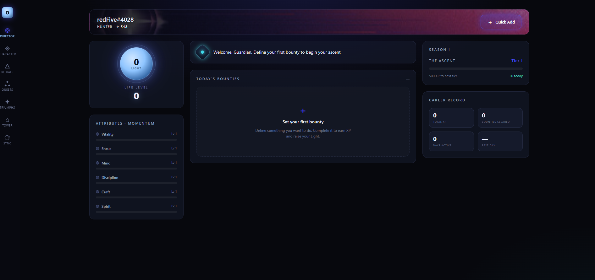
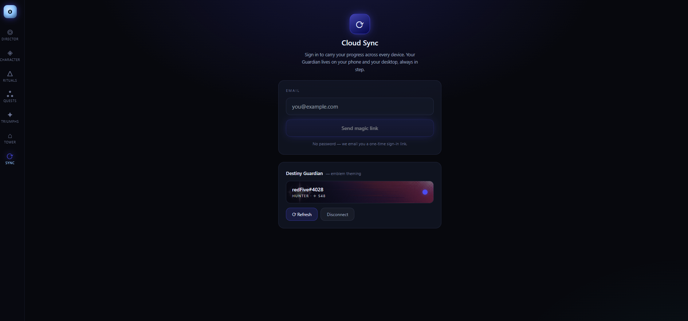

# Orbit

A personal life management web app that turns habits, goals, and tasks into a Destiny 2-style character sheet, themed with real game assets from the Bungie API.

**Live:** [orbit-kappa-five.vercel.app](https://orbit-kappa-five.vercel.app)

## The problem

In FIN 411 Advanced Financial Modeling at BYU-Idaho, every student completed a 15-hour personal project. The assignment was to build something real (a model, tool, report, or automation), tie it to business and AI, and keep it original to the class. Reading or watching didn't count; it had to be hands-on.

I chose to build a full web app with an AI coding tool, something I had never done before. The goal was a personal dashboard that tracks the things I want to improve in my life the way Destiny 2 tracks a character: stats that level up, streaks, achievements, and rewards, all on one screen.

## What I built

I built Orbit with Claude Code over about a week in July 2026, in 13 commits, and deployed it as a live website.

- **Six life attributes** tracked like RPG stats, shown on a character sheet with a radar chart
- **Bounties** (tasks), **Rituals** (recurring daily or weekly habits with streaks), and **Quests** (multi-step goals)
- **Triumphs and Seals:** achievements that unlock titles you can equip
- **The Tower:** a reward shop where earned currency buys rewards I define for myself
- **Destiny 2 integration:** enter a Bungie name, and the app reads that player's most recently played character, themes the whole page with its emblem colors and art, and shows live in-game milestones
- **Works on phone and desktop:** a phone layout for quick capture and a multi-panel desktop layout, with data that saves on the device and syncs across devices after signing in with an email link

**How it works underneath:** every completed task or habit is saved as one entry in an append-only log, like a general ledger. Nothing is ever edited or overwritten. XP, levels, streaks, and achievements are all calculated from that log, the same way account balances are calculated from journal entries.

## Tools

Claude Code (AI-assisted development), React, TypeScript, Tailwind CSS, Supabase (database, sign-in, and sync), Bungie API, Vercel (hosting), Git and GitHub

## Results

- Scored 100/100 on the FIN 411 personal project
- Deployed and live at [orbit-kappa-five.vercel.app](https://orbit-kappa-five.vercel.app)
- Went from an empty folder to a deployed app with cloud sync and a live game API in about a week

## What I learned

- **How to direct an AI coding tool.** Claude Code wrote the code, but I had to decide what to build, break it into steps, test each step in the browser, and catch what didn't work. Each commit is one feature I planned, checked, and approved.
- **Ledger thinking works outside accounting.** Storing every action as a permanent entry and calculating totals from it made the app reliable and easy to sync: two devices can combine their entries without conflicts. It's the same principle behind double-entry bookkeeping and an audit trail.
- **How to work with an outside API.** Pulling data from Bungie meant reading the API documentation, turning a player name into an account ID, choosing the right character, and handling slow or failed requests. I also learned to save results on the device so the page loads fast and still works when the API doesn't answer.
- **Keeping secrets out of code.** API keys and database credentials live in environment settings, not in the code, so the project can be shared without exposing them.
- **Debugging and deploying.** I tracked down real bugs, like a pop-up window that wouldn't close in the live build, and a sign-in link that only worked on the device that requested it. I also learned how hosting works: every push to GitHub updates the live site automatically.

## How to run it or view it

Open the [live site](https://orbit-kappa-five.vercel.app). To see the Destiny 2 theming, open the **Sync** tab and enter a Bungie name. The source code is private for now.

## Screenshots

**Director (desktop):** the home screen, themed with my Destiny 2 emblem

**Sync:** email sign-in for cross-device sync, and a connected Destiny 2 Guardian

